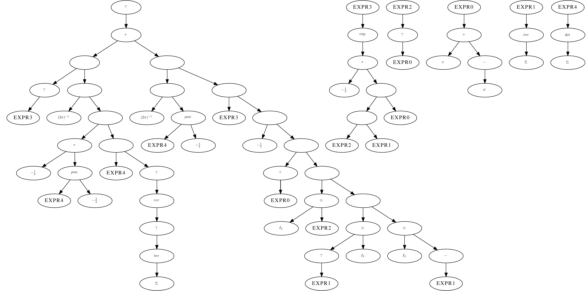

## Tensor-Matrix-Diff

**T**ensor-**M**atrix-**D**iff(TMD) is a symbolic differentiation system. Unlike the [Symbolic Math Toolbox](https://www.mathworks.com/help/symbolic/symbolic-computations-in-matlab.html) of MATLAB which calculates the derivatives of a tensor function in an element-by-element sense, TMD aims to calculate the derivatives while treating matrices as the minimum unit of operation.

TMD is mainly inspired by a series of Zhihu articles([1st episode](https://zhuanlan.zhihu.com/p/24709748) and [2nd episode](https://zhuanlan.zhihu.com/p/24863977)). We thank the [author](https://www.zhihu.com/people/chang-qu-gui-xia) for his/her great introduction to matrix differentiation.

Here is an example result: the partial derivative of 2D gaussian function to the variance:



## Integration

The project export a cmake target `TMD`. To enable slow evaluation of the expression type, set `IMPLEMENT_SLOW_EVALUATION` to `true` before adding our project.

## Example

One example can be found in `examples/gaussian.cc`. To build the example:

```shell
mkdir build
cd build
cmake .. -DCMAKE_BUILD_TYPE=Release -DBUILD_EXAMPLE=true
make -j4
./examples/gaussian 2 # The parameter is the dimension of the normal distribution
```

The example outputs will be placed in `examples/outputs`. There will be two files: `gaussian.tex` and `gaussian_gradient.tex`. Compile them to obtain the graphic views of the two expressions.