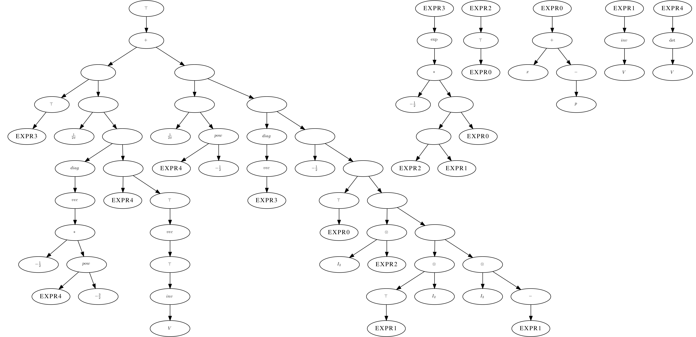

## Tensor-Matrix-Diff

**T**ensor-**M**atrix-**D**iff(TMD) is a symbolic differentiation system. Unlike the [Symbolic Math Toolbox](https://www.mathworks.com/help/symbolic/symbolic-computations-in-matlab.html) of MATLAB which calculates the derivatives of a tensor function in an element-by-element sense, TMD aims to calculate the derivatives while treating matrices as the minimum unit of operation.

TMD is mainly inspired by a series of Zhihu articles([1st episode](https://zhuanlan.zhihu.com/p/24709748) and [2nd episode](https://zhuanlan.zhihu.com/p/24863977)). We thank the [author](https://www.zhihu.com/people/chang-qu-gui-xia) for his/her great introduction to matrix differentiation.

Here is an example result: the partial derivative of 2D gaussian function to the variance:

